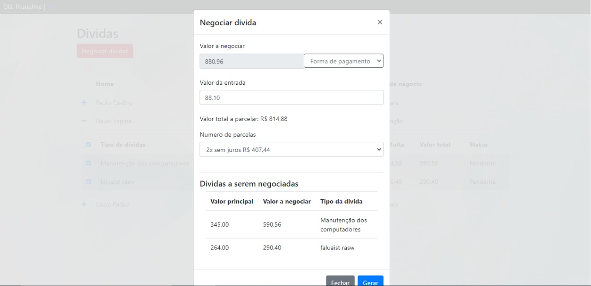
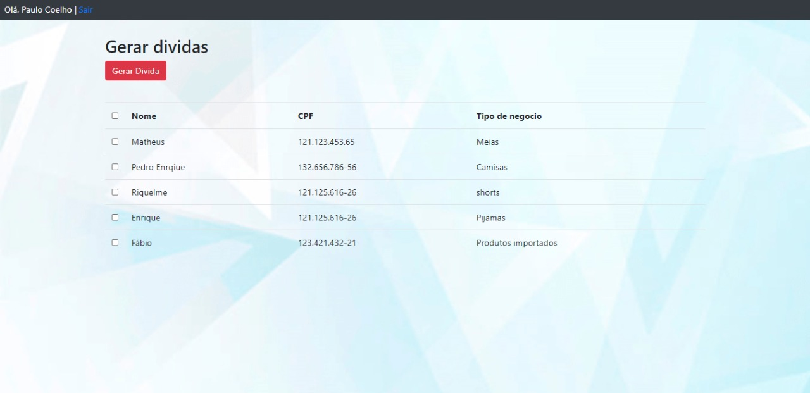
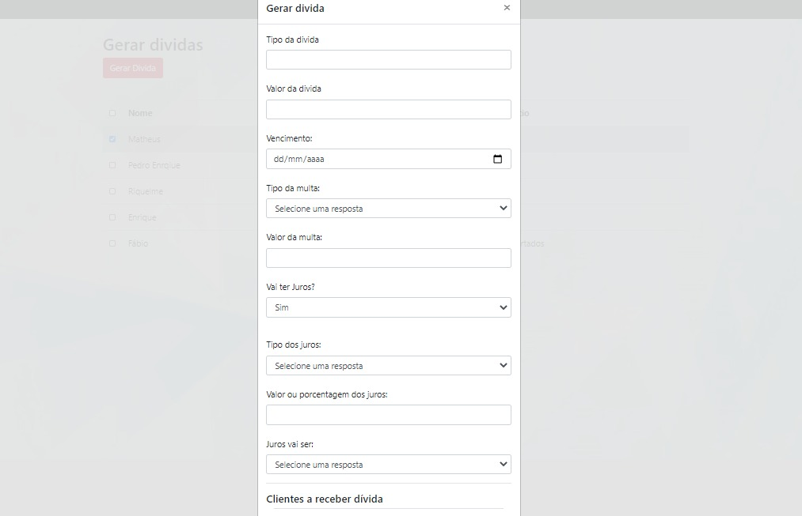

# Negociacoes

<a href='#negociacoes'>NEGOCIAÇÕES </a>|
<a href='#functionalities'>FUNCIONALIDADES </a>|
<a href='#tecnologies'>TECNOLOGIAS </a>|
<a href='#layout'>LAYOUT </a>|

## 
📚 Negociações 

Sistema em desenvolvimento de simulamento de negociações de dividas. O sistema funciona como um banco com cadastros de CPF e CNPJ que geram e recebm dividas, e o banco é quem faz os emprestimos, simulando um lucro, atravez da regra de negocios do sistema. Sistema pessoal, feito para exercitar minha lógica e treinar conhecimentos principalmente em Java Script.

---

## 
 ⚙ Funcionalidades 

1. Um CNPJ gerá as dividas nos CPF's especificados com o valor, nome do produto, vencimento e como quer os juros. 
2. O CPF que recebe a divida escolhe como quer pagar, como as parcelas e quais dividas quer pagar.
3. O sistema calcula os juros e multas da divida atraves do numero de parcelas, vencimento e do tipo de juros especificado por quem gerou a divida.
4. Sistema de login com cadastro. 

---

## 
💻 Tecnologias 

<a href='https://www.php.net/manual/pt_BR/intro-whatis.php'>PHP</a>
 
<a href='https://www.javascript.com/'>JavaScript</a>
 
<a href='https://www.mysql.com/'>MySQL</a>
 
<a href='https://developer.mozilla.org/pt-BR/docs/Web/Guide/AJAX'>AJAX</a>
 

---

## 
🎨 Layout ? 

